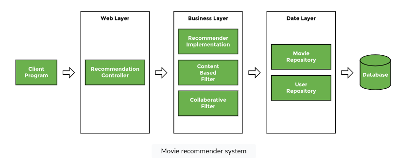

# Recommender Movie api 📽

## Spring Boot:

Spring Boot is an open-source Java framework that simplifies the development of Java applications by providing a
streamlined and opinionated approach to application configuration and deployment. It is built on top of the Spring
Framework and offers a set of powerful features and conventions to accelerate application development.

#### **Stereotype Annotations**

Let's explore the different annotations that can be used in place of the generic @Component annotation and their usage.

The web or UI layer interacts with the client program, the service layer provides an abstraction between the web and
data access layer as well as taking care of the business logic, and the data layer interacts with a database or an
external interface. @Component is a generic annotation. It can be used in any layer, if the developer is unsure about
where the bean belongs. The other three annotations, **_@Controller_**, **_@Service_**, and **_@Repository_**, are specific to layers.

#### **Creating a REST Service**

In this lesson, we will create a REST service using Spring Boot

### @**RestController**

to inform Spring that this is a controller class. A controller is a Java class that maps a URI to a
method. When the method is executed, it returns a response. A @RestController is a specialized form of @Controller
annotation which handles REST requests and responses. It automatically handles conversion to JSON.